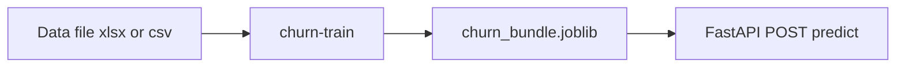
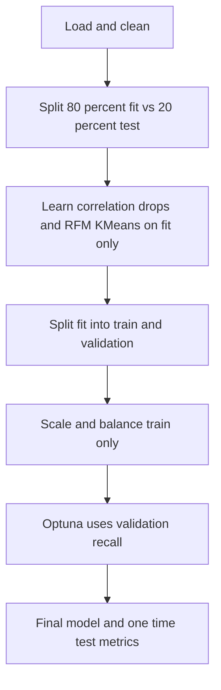

# Telecom Customer Churn ML Pipeline

License: MIT · Python 3.11+ · CI

End-to-end churn modeling: cleaning, correlation pruning, RFM + K-Means segmentation, SMOTE + undersampling, RFECV feature selection, model benchmarking, Optuna-tuned XGBoost, evaluation plots, SHAP explainability, serialized **inference bundle**, and an optional **FastAPI** service.

**Short GitHub description (for “About”):**  
Telecom churn classification — sklearn + XGBoost, imbalance handling, RFECV, Optuna, SHAP, training CLI and FastAPI scoring.

---

## Table of contents

- Executive summary
- Quick diagrams
- Repository layout
- Local development
- Training CLI
- Inference API
- Reproducibility and CI
- Modeling workflow (high level)
- Roadmap

---

## Executive summary

| Design goal   | How it is addressed |
| ------------- | ------------------- |
| Traceability  | `metrics.json` + `model_benchmark.csv` under `artifacts/` after each train. |
| Packaging     | Installable `telecom_churn` package under `src/`, console script `churn-train`. |
| Serving       | FastAPI loads `ChurnEndToEndModel` from `artifacts/churn_bundle.joblib` (raw row → score). |
| Leakage control | Correlation + KMeans fit on the **fit** split only; Optuna scores **validation**; **test** is held out for final metrics. |
| CI without data | `compileall` + pytest (imports, correlation helper, end-to-end unit tests). |

---

## Quick diagrams

### From data to scoring



### Training splits at a glance



---

## Repository layout

```
.
├── data/                     # Place mobile-churn-data.xlsx here (gitignored)
├── src/telecom_churn/        # Library: preprocessing, segmentation, train, end_to_end model
├── api/main.py               # FastAPI inference (optional extra)
├── artifacts/                # Created by training (gitignored)
├── images/                   # Plots from training (gitignored)
├── tests/
├── customer_churn_analysis.ipynb
├── main.py                   # Thin wrapper → telecom_churn.cli:main
├── pyproject.toml
├── requirements.txt
├── LICENSE
├── README.md
└── .github/workflows/ci.yml
```

---

## Local development

```powershell
git clone https://github.com/Vedv7/Telecom-Customer-Churn-ML-Pipeline.git
cd Telecom-Customer-Churn-ML-Pipeline
python -m venv .venv
.\.venv\Scripts\activate
pip install -e ".[dev,api]"
```

Copy your churn workbook to `data/mobile-churn-data.xlsx` (or pass `--data`).

On Linux or macOS, use `source .venv/bin/activate`.

---

## Training CLI

After editable install:

```powershell
churn-train --data data/mobile-churn-data.xlsx --trials 100
```

Or, without installing the `churn-train` script on your PATH:

```powershell
python -m telecom_churn --data data/mobile-churn-data.xlsx --trials 100
```

Legacy entrypoint:

```powershell
python main.py --data data/mobile-churn-data.xlsx --trials 100
```

Outputs (default `--out artifacts`):

- `artifacts/churn_bundle.joblib` — **v2** bundle: `ChurnEndToEndModel` (clean → correlation → RFM cluster → scale → XGBoost) for one-shot inference
- `artifacts/metrics.json` — split policy, `expected_input_columns`, selected features, validation recall from tuning
- `artifacts/model_benchmark.csv` — cross-validated benchmark table
- `images/` — confusion matrix, ROC/PR curves, SHAP plots (unless `--skip-shap`)

Legacy **v1** bundles (model + scaler + column lists only) are still supported by `predict_row` if you load an older artifact.

---

## Inference API

Train first so `artifacts/churn_bundle.joblib` exists. Then:

```powershell
$env:CHURN_BUNDLE_PATH = "artifacts/churn_bundle.joblib"
uvicorn api.main:app --reload
```

- `GET /health` — bundle load status and `bundle_version` (2 = end-to-end)  
- `GET /schema` — `expected_input_columns` for v2 bundles (legacy v1 returns 400 with guidance)  
- `POST /predict` — JSON `{"features": { ... }}` using **spreadsheet-like** column names for one row (same schema as training before cleaning). The server runs the same cleaning, correlation pruning, and clustering as training, then scales and scores. Optional `churn` is ignored. If the row maps to the configured low-value RFM cluster, the response is `{"eligible": false, "reason": "low_value_segment", ...}` instead of a score.

For offline inspection, see `artifacts/metrics.json` → `expected_input_columns`.

---

## Reproducibility and CI

GitHub Actions (`.github/workflows/ci.yml`) installs `pip install -e ".[dev,api]"` plus `requirements.txt`, runs `python -m compileall` on `src`, `tests`, and `api`, and runs `pytest`. **Full training is not executed in CI** because the Excel file is not stored in the repository.

---

## Modeling workflow (high level)

1. Load CSV/XLSX → clean identifiers, memory downcast.  
2. **Outer split** (e.g. 80/20 stratified): fit split vs held-out **test**.  
3. Learn correlation drops on the **fit** split only; apply to test.  
4. Fit RFM scaler + K-Means on the **fit** split; assign `cluster` to both; drop low-value segment on each side.  
5. **Inner split** of the fit portion → **train** vs **validation** (stratified).  
6. `StandardScaler` fit on train only → SMOTE + undersample **train**; transform val/test with that scaler.  
7. RFECV (Random Forest, recall) on balanced train; benchmark models.  
8. Optuna tunes XGBoost on **validation** recall (test is not used for tuning).  
9. Final `XGBClassifier` on balanced train; evaluate once on **test**; SHAP; persist `ChurnEndToEndModel` + metrics.

---

## Roadmap

| Priority | Item |
| -------- | ---- |
| P1       | Pin a `requirements-lock.txt` after a clean full-environment train |
| P1       | Refactor `ChurnEndToEndModel` into sklearn `Pipeline` steps where row-safe |
| P2       | MLflow experiment tracking |
| P2       | Streamlit or batch scoring CLI |
| P3       | Drift detection for production monitoring |

---

## License

This project is licensed under the MIT License — see [LICENSE](LICENSE).

---

## Author

**Veda Swaroop** — applied ML, churn analytics, and production-oriented tooling.

---

### Related layout

This repository mirrors the structure of the domestic flight fare project ([Predicting-flight-rates-through-advanced-regrression](https://github.com/Vedv7/Predicting-flight-rates-through-advanced-regrression)): `pyproject.toml`, `src/<package>`, CLI entry point, `tests/`, `api/`, CI workflow, and MIT license.
